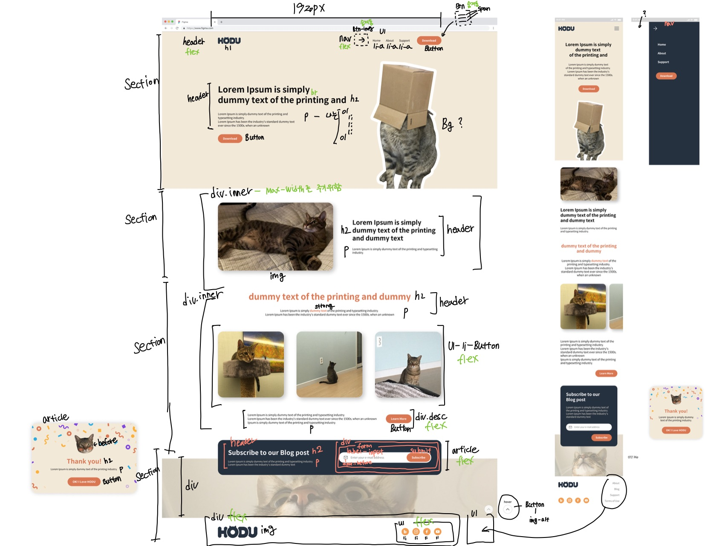

# randing-page

멋쟁이 사자처럼 프론트엔드 스쿨 개인 프로젝트 랜딩페이지 구현 과제입니다.

내가 그린 그림을 소개하는 페이지를 만들어 보았습니다.

[랜딩 페이지 링크](https://yooss2006.github.io/randing-page/index.html)

[랜딩페이지 피그마 링크](https://www.figma.com/file/rCC8TcOBAmNlQXI4vbmXAo/%EB%9E%9C%EB%94%A9%ED%8E%98%EC%9D%B4%EC%A7%80)

## 랜딩페이지 손 마크업 이미지

 

## 랜딩 페이지 요구사항 명세

1. 피그마를 참고하여 페이지 구현을 합니다.
2. 모바일 화면도 고려하여 페이지 구현을 합니다.
3. 스크롤시 헤더가 고정되게 합니다. (단, 처음에는 고정된 상태가 아닙니다.)
4. 스크롤 탑 버튼을 구현합니다.
   1. 스크롤 탑 버튼은 스크롤시 나타납니다.
   2. 스크롤 탑 버튼은 푸터 아래로 내려가지 않습니다.
   3. 스크롤 탑 버튼을 누르면 스크롤이 최상단으로 올라갑니다. (단, 부드럽게 올라가야 합니다.)
5. 구독하기 모달창
   1. 이메일을 입력하고 `Subscribe` 버튼을 클릭하면 모달창이 나타납니다.
   2. 이메일 유효성 검사를 진행해야 합니다. (값이 들어가지 않거나 이메일 형식이 유효하지 않으면 alert 창으로 경고 문구가 떠야합니다.)
   3. 이메일이 잘 입력되었다면 모달창이 뜹니다. 이때 모달창의 `돌아가기` 버튼을 클릭하면 form이 제출되고 모달창이 닫힙니다.

 

## 사용 기술

- html
- css
  - sass
- javascript

 

## 느낀점

처음엔 BEM 설계기법을 이용해 개발을 했었다. 마크업이며 css며 나름 잘했다고 생각었다.

이후에 청귤마켓 프로젝트에 돌입하고 퍼블리싱 스터디를 받으며 나름 발전한 뒤에 다시 랜딩페이지를 보니 고쳐야할 부분이 많이 보였다.

html css 부분에서 불필요한 요소를 많이 넣은 것 같아 싹 갈아 엎었다. sass를 이용해서 mixin기법과 변수를 사용하는 연습을 했으며 사이즈를 vw로 맞춰 화면이 줄어들면 그거에 맞춰 같이 줄어드는 스타일을 적용하였다.

꽤 많은 시간이 걸렸지만 이전보다 많이 늘은 것 같아 보람찬 프로젝트였다.

 

## 코드리뷰 사항

시각적인 부분으로 섹션을 묶었음 -> 불필요한 섹션 + header 사용

- 많이 사용할 필요 없다.
